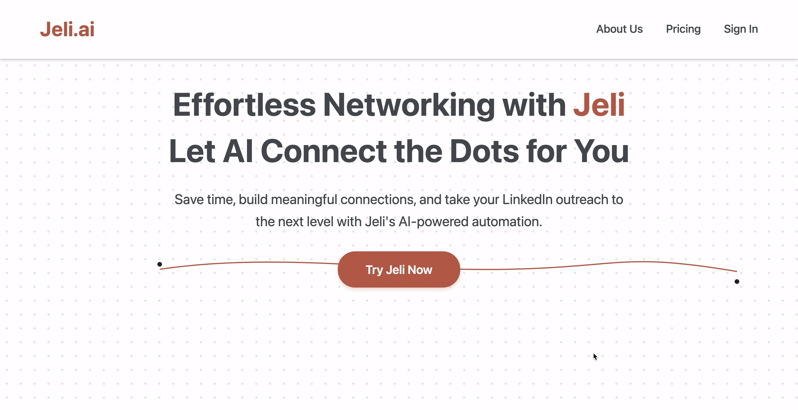

# Jeli.ai

Effortless Networking with AI: Jeli.ai helps you connect, organize, and scale your professional outreach, making networking powerful and stress-free.



---

## Overview

Jeli.ai is your AI-powered assistant for managing LinkedIn and professional outreach. Save time, build meaningful connections, and let Jeli automate the tedious parts of your networking workflow. Simply focus on the conversations that matter; Jeli takes care of the rest.

---

## 🚀 Tech Stack

- **Frontend:** React, **Next.js** (App Router, TypeScript), **Tailwind CSS**, PostCSS  
- **State:** **Zustand**  
- **UI Package:** `packages/ui` (shared components + store)  
- **E2E Testing:** **Playwright** (+ GitHub Actions CI)  
- **Package Manager:** **pnpm**  
- **Node:** 18+ (also tested on 20)

---

## ✨ Features

- **Automated LinkedIn Outreach**
  - Identify potential connections based on your goals and interests.
  - AI-driven suggestions for who to reach out to next.
- **Dashboard for Pipeline Management**
  - Columns for **Yet to Reach Out**, **Pending**, **Connected**.
  - Move contacts between stages and take actions quickly.
- **Follow-Up Reminders**
  - Keep track of replies and scheduled nudges.
- **Personalized Messaging**
  - AI-generated first-touch and follow-up drafts.
  - Cold email / LinkedIn templates.
- **Network Organization**
  - Group contacts by status and see your pipeline at a glance.

---

## 📁 Project Highlights

- `app/` — Next.js App Router pages (e.g., `app/page.tsx`, `app/dashboard/page.tsx`)  
- `app/api/health/route.ts` — simple health-check endpoint  
- `packages/ui/` — shared UI & Zustand store (`index.ts`, `store.ts`)  
- `tests/e2e/` — Playwright specs (`smoke.spec.ts`)  
- `.github/workflows/playwright.yml` — CI for build + e2e  

> `next.config.js` includes:
> ```js
> transpilePackages: ["zustand", "@jeli/ui"]
> ```

---
## 🚀 Getting Started

### Clone the Repository
```bash
git clone https://github.com/aiskakov28/jeli_ai.git
cd jeli_ai
```

### Install Dependencies
```bash
pnpm install
```

Run Development Server
```bash
pnpm dev
# ➜ http://localhost:3000
```

⚡ Build & Start
```bash
pnpm build
pnpm start
```

🧪 Run E2E (Local)
```bash
# install browsers once
pnpm exec playwright install

# run tests
pnpm exec playwright test
```

## 🔄 Continuous Integration

This repo includes **GitHub Actions** (`.github/workflows/playwright.yml`) that:

- 📦 Install dependencies with **pnpm**
- ⚡ Build the **Next.js** app
- 🚀 Start the server
- 🧪 Run **Playwright** E2E tests
- 📊 Upload the HTML test report as an artifact

---

## 🧩 Example Workflow

1. 🔍 See all **“Potential Connects”** on the dashboard  
2. ✉️ Open a profile and generate a personalized message  
3. ⏳ Mark as **Pending** after outreach  
4. 🤝 Move to **Connected** once accepted and continue nurture  

---

## 💡 Why Jeli.ai?

- ⚡ **Streamlines outreach**  
- 🤖 **Powers personalized connections with AI**  
- 🎯 **Helps you focus on relationships, not manual tasks**  

Helps you focus on relationships, not manual tasks
